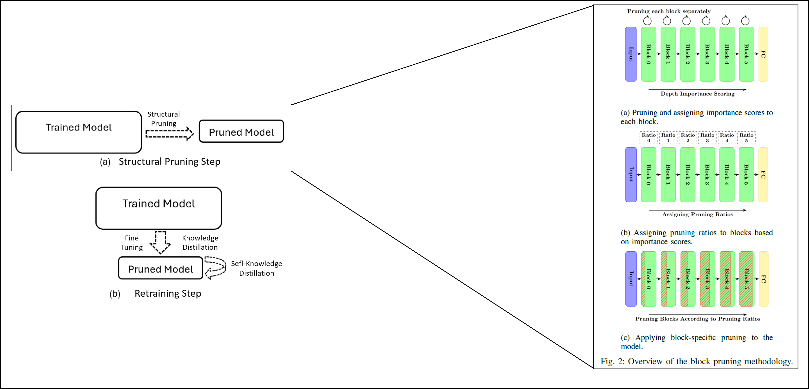

# Spectrogram Segmentation with Compression

The successful application of [semantic segmentation](https://www.ibm.com/topics/semantic-segmentation) to radiofrequency (RF) spectrograms holds significant applications for [spectrum sensing](https://iopscience.iop.org/article/10.1088/1742-6596/2261/1/012016#:~:text=In%20cognitive%20radio%2C%20spectrum%20sensing,user%20can%20use%20the%20spectrum.) and serves as a foundational example showcasing the near-term feasibility of [intelligent radio](https://www.qoherent.ai/intelligentradio/) technology.

In this extended work, we build on the original spectrogram segmentation model by incorporating advanced **model compression techniques**, including **pruning** and **knowledge distillation**, to create a more efficient and lightweight version of the model. These techniques are essential for deploying models in resource-constrained environments, such as IoT devices, while maintaining high performance.

This project uses [PyTorch](https://pytorch.org/) and [Lightning](https://lightning.ai/docs/pytorch/stable/) to train and compress a segmentation model that identifies and differentiates between 5G NR and 4G LTE signals within wideband spectrograms. The compression techniques applied significantly reduce the model's size and computational requirements without compromising accuracy.

Qoherent's mission to drive the creation of intelligent radio technology requires a combination of open-source and proprietary tools. This example leverages open-source tools and machine learning frameworks to train on synthetic radio data generated using MATLAB. Additionally, it showcases our commitment to interoperability and tool-agnostic innovation by demonstrating how model compression techniques can make intelligent radio solutions more feasible for practical deployment.

Classification results are comparable to those reported by MathWorks' AI-based network, and the compression methods provide significant reductions in model size and inference time. For more information, please refer to the following article by MathWorks: [Spectrum Sensing with Deep Learning to Identify 5G and LTE Signals](https://www.mathworks.com/help/comm/ug/spectrum-sensing-with-deep-learning-to-identify-5g-and-lte-signals.html).

If you found this example interesting or helpful, don't forget to give it a star! ⭐

---

## 🚀 Getting Started

This project provides examples in Jupyter Notebooks to demonstrate both the original segmentation model and the compressed model. You can run the notebooks locally or on Google Colab.

### Running this example locally

Please note that running this example locally will require approximately 10 GB of free space. Ensure you have sufficient space available prior to proceeding.

1. Ensure that [Git](https://git-scm.com/downloads) and [Conda](https://conda.io/projects/conda/en/latest/user-guide/install/index.html) are installed on the computer where you plan to run this example. Additionally, if you'd like to accelerate model training with a GPU, you'll require [CUDA](https://docs.nvidia.com/cuda/cuda-quick-start-guide/index.html).

2. Clone this repository to your local computer:
```commandline
git clone https://github.com/Mohammad-Hallaq/spectrogram-compression

```


3. Create a Conda environment using the provided `environment.yml` file:
```commandline
conda env create -f environment.yml
```
This will create a new Conda environment named `spectrogram-compression` within the Conda installation directory.


4. Active the environment:
```commandline
conda activate spectrogram-compression
```


5. Download and unpack the spectrum sensing dataset:
```commandline
python download_dataset.py
```
This command will create a new directory named `SpectrumSensingDataset` at the project's root. The 
MathWorks Spectrum Sensing dataset will be downloaded and unpacked into this directory automatically.


6. Register the environment kernel with Jupyter:
```commandline
ipython kernel install --user --name=spectrogram-compression
```


7. Open the notebook, `spectrogram_segmentation.ipynb`, specifying to use the `spectrogram-segmentation` kernel:
```commandline
jupyter notebook spectrogram_segmentation.ipynb --MultiKernelManager.default_kernel_name=spectrogram-segmentation
```


8. Give yourself a pat on the back - you're all set up and ready to explore the example! For more information on 
navigating the Jupyter Notebook interface and executing code, please check out this tutorial by the Codecademy 
Team: [How To Use Jupyter Notebooks](https://www.codecademy.com/article/how-to-use-jupyter-notebooks).

Depending on your system specifications and the availability of a CUDA, running this example locally may take 
several minutes. If a cell is taking too long to execute, you can interrupt its execution by clicking the "Kernel" 
menu and selecting "Interrupt Kernel" or by pressing `Ctrl + C` in the terminal where Jupyter Notebook is running.


9. After you finish exploring, consider removing the dataset from your system and deleting the Conda environment to 
free up space. You can delete the Conda environment using the following command:
```commandline
conda env remove --name spectrogram-segmentation
```

<!-- ### Running this example in Google Colab

**Coming soon:** Don't want the hassle of downloading the project and dataset and setting up a Conda environment? 
We've shared the notebook on Google Colab: [Spectrogram Segmentation]().
 -->

## 🔧 Compression Techniques

This project applies the following advanced techniques to enhance the model's efficiency:

### Structured Pruning

The structured pruning process evaluates the importance of each model block based on metrics such as loss, parameter count, and MACs (Multiply-Accumulate Operations). It determines pruning ratios dynamically using a combination of weighted importance scores and exponential decay. This approach ensures that the least critical parts of the model are removed while retaining performance.

### Retraining the Pruned Model

After pruning, the retraining step ensures the model regains performance. This step can be performed using:
- **Conventional Fine-Tuning**: Adjusting the pruned model on the training dataset.
- **Knowledge Distillation**: Transferring knowledge from a larger "teacher" model to the pruned "student" model.
- **Self-Knowledge Distillation**: Allowing the model to distill knowledge from its own predictions over multiple iterations.

These methods can also be combined using a weighted loss function to balance their contributions during retraining.

### Visual Representation

Below is a visual representation of the structured pruning algorithm and retraining process:




## 📊 Output

This work introduces an effective compression framework that significantly reduces the size and complexity of deep learning models while maintaining high performance, specifically for spectrum segmentation tasks. Through structured pruning, guided by gradient-based importance scoring, we can achieve remarkable reduction in model size, in parameters count, and in MACs. Additionally, inference latency is improved, making the compressed model well-suited for deployment in edge devices with limited computational resources.

Our experiments show that knowledge distillation alone is highly effective for retraining the pruned model, maintaining robustness and generalization without requiring labelled data. This eliminates a significant barrier to scalability, particularly in scenarios where labelled data is scarce or unavailable. We can also explore self-knowledge distillation through this work. 

The proposed framework demonstrates its suitability for real-world wireless communication applications, offering a scalable and efficient solution for 6G and IoT environments.


## 🤝 Contribution

We welcome contributions from the community! Whether it's an enhancement, bug fix, or improved explanation, 
your input is valuable. For significant changes, or if you'd like to prepare a separate tutorial, kindly 
[contact us](mailto:info@qoherent.ai) beforehand.

If you encounter any issues or to report a security vulnerability, please submit a bug report to the GitHub Issues 
page [here](https://github.com/qoherent/spectrogram-segmentation/issues).

Has this example inspired a project or research initiative related to intelligent radio? Please [get in touch](mailto:info@qoherent.ai); 
we'd love to collaborate with you! 📡🚀

Finally, be sure to check out our open-source project: [RIA Core](https://github.com/qoherent/ria) (Coming soon!).


## 🖊️ Authorship
This work is an extension of the work by the Qoherent team, with contributions in compression techniques by [Mohammad](https://github.com/Mohammad-Hallaq).

The original work on spectrum segmentation is a product of the collaborative efforts of the Qoherent team. Of special mention are [Wan](https://github.com/wan-sdr), 
[Madrigal](https://github.com/MadrigalDW), [Dimitrios](https://github.com/DimitriosK), and [Michael](https://github.com/mrl280).


## 🙏 Attribution

The dataset used in this example was prepared by MathWorks and is publicly available [here](https://www.mathworks.com/supportfiles/spc/SpectrumSensing/SpectrumSenseTrainingDataNetwork.tar.gz). For more information 
on how this dataset was generated or to generate further spectrum data, please refer to MathWork's article on spectrum 
sensing. For more information about Qoherent's use of MATLAB to accelerate intelligent radio research, check out our 
[customer story](https://www.mathworks.com/company/user_stories/qoherent-uses-matlab-to-accelerate-research-on-next-generation-ai-for-wireless.html).

The DeepLabv3 models used in this example were initially proposed by Chen _et al._ and are further discussed 
in their 2017 paper titled '[Rethinking Atrous Convolution for Semantic Image Segmentation](https://arxiv.org/abs/1706.05587)'. The MobileNetV3 
backbone used in this example was developed by Howard _et al._ and is further discussed in their 2019 paper titled 
'[Searching for MobileNetV3](https://arxiv.org/abs/1905.02244)'. Models were accessed through [`torchvision`](https://pytorch.org/vision/stable/models/deeplabv3.html).

A special thanks to the PyTorch and Lightning teams for providing the foundational machine learning frameworks used in 
this example.
